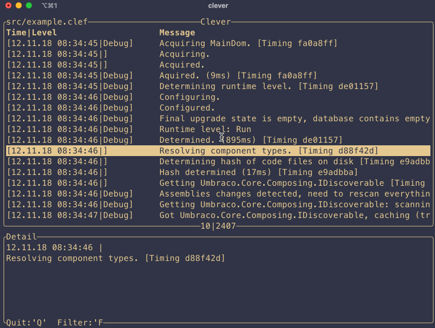

# clever

Clever is a simple cli application to view \*.clef logs. Written in Rust &amp; powered by Ratatui

# Installation

Currently clever cannot be installed through any package manager. Contributions regarding this are welcomed.

To install it manually, just download from the release page and add it to our path variable.

# Usage

Simply by:

`clever path\to\file`

a simple cli is also planned to nicly format the logs. Use:

`clever --help`

to print the available cli commands & options.

# Notes

Currently only templates using {PropertyName} are rendering, support for index rendering and other message template features is planned.

# Contribution

Simply open a PR. Repo is using convetional commits, please stick to it if you want to contribute. Apart from this, nothing special to consider right now.

# Links

- <http://clef-json.org>

- <https://messagetemplates.org>

- <https://ratatui.rs>
